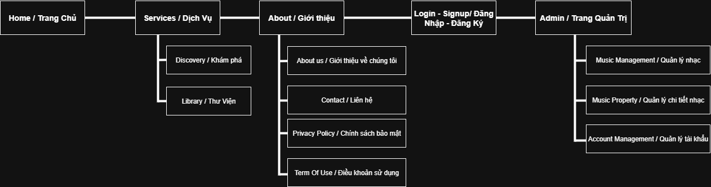
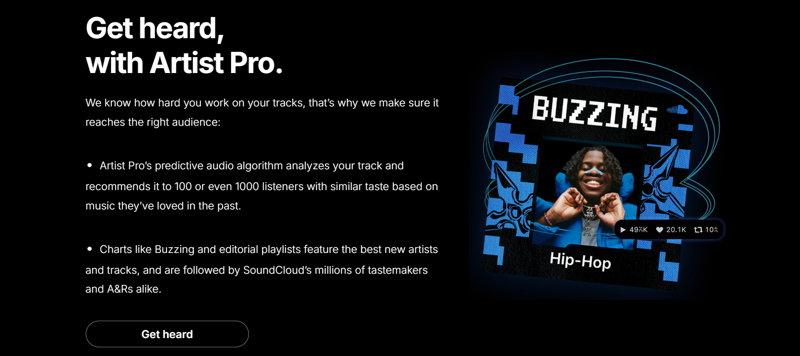
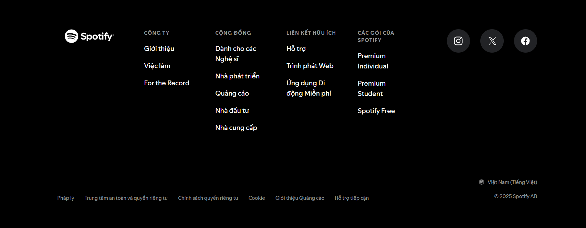

## Overview/Purpose
- **Spinify** là một dự án phát triển platform phát nhạc trực tuyến miễn phí cho mọi người trên đa thiết bị thông qua Website trực tuyến.
- **Spinify** lấy ý tưởng từ đĩa than làm phong cách chính cho nền tảng phát nhạc, mang phong cách hoài cổ và sang trọng, tập trung phát triển trang Website thành một nơi để thư giãn hoặc trang trí cho Laptop hoặc ngoại cảnh nhờ các Animation khi nghe nhạc.
## Teams

| STT | MSSV           | Họ Và Tên            |
| --- | -------------- | -------------------- |
| 1   | **221A290048** | **Ngô Quang Trường** |
| 2   | **221A010742** | **Phạm Văn Diện**    |

## Phases
- **Phase 1:** Lập kế hoạch và thiết kế Figma.
- **Phase 2:** Thiết kế giao diện bằng HTML / CSS (Reponsive)
- **Phase 3:** Thêm các tính năng vào trang Web.
- **Phase 4:** Kiểm thử và sửa lỗi, đảm bảo các yêu cầu hoạt động đúng mục đích.
- **Phase 5:** Cập nhật và thay đổi để cải thiện Website dựa trên yêu cầu.

## Content

#### Home / Trang Chủ
- Trang chủ cung cấp thông tin về Website có chứa các phần sau:
    - **Header:** Chứa Logo, Thanh tìm kiếm, đăng nhập, đăng ký, được thể hiện dưới dạng slide show như bên dưới.
    
        - ***Inspire:** Sound Cloud*
    
    - **Trending Playlist Display:** Hiển thị các bài hát hot.
    
        - ***Inspire:** Youtube musics*
        
    - **Banner:** Đây là nơi để viết về thông tin chung của trang Web để thu hút người dùng và giới thiệu cho người dùng về thông tin Website
    
        - ***Inspire:** Sound Cloud Artists*
        
    - **Footer:** Chứa các thông tin ở phần About
    
        - ***Inspire:** Spotify Footer*

#### Services / Dịch Vụ
- Đối với các trang Services sẽ có công dụng phát nhạc cho người dùng các nội dung của Service sẽ chỉ khác nhau ở Data chứ không thay đổi thiết kế trang Web.
- Các thành phần chính
    - Header: Chứa Logo, Thanh tìm kiếm, User Profile
    
        - ***Inspire:** Spotify Header*
        
    
        - ***Inspire:** Youtube Music Header*
        
    - **Slidebar Navigation:** Cung cấp thanh điều hướng cho người dùng, có 2 phần điều hướng là Khám phá và Thư viện đồng thời hiển thị các Playlist (Thư Viện) của người dùng
    
        - **Inspire:** Spotify Navigator* 
        
    
        - ***Inspire:** Youtube Music Navigator* 
        
    - Main Content: Đây là nơi để hiển thị nội dung chính các đề xuất nhạc cho người dùng lựa chọn, đối với các bài tổng hợp nhạc chúng ta sẽ dùng chủ đề băng Cassette để thiết kế.
    
    
        - ***Inspire:** Spotify Main Content* 
    
    
        - ***Inspire:** Youtube Music Main Content* 

#### Login/ Sign Up
- **Sign Up:** là trang để người dùng đăng ký tài khoản để sử dụng Website và tính năng bổ sung của nền tảng như tạo Playlist, Lưu bài yêu thích...

    - ***Inspire:** Spotify Sign Up* 

    - ***Inspire:** Google Sign Up*

